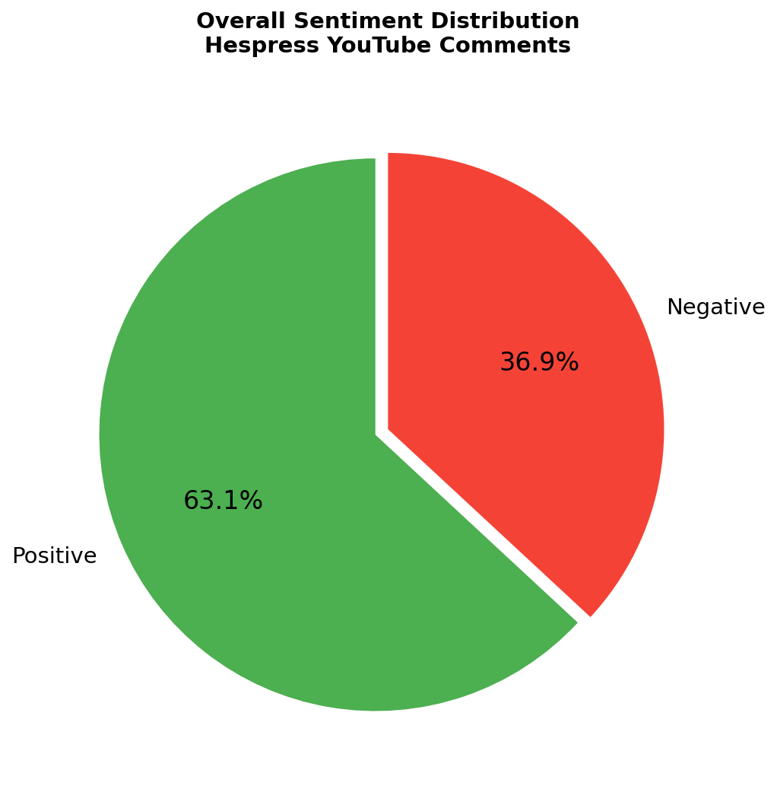
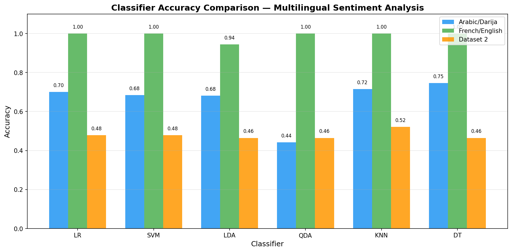
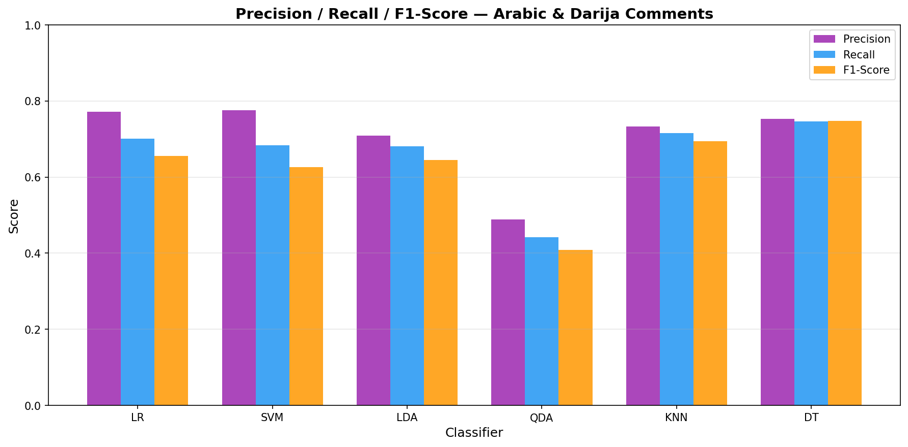

# Multilingual Sentiment Analysis — YouTube Comments

Sentiment analysis system for YouTube comments in **Arabic, Darija, French & English**,
applied to Hespress trending videos.

## Overview
- Scraped 2,500+ comments via YouTube Data API v3
- Multi-language detection: Arabic · Darija · French · English
- MongoDB storage pipeline
- 6 ML classifiers compared: Logistic Regression, SVM, LDA, QDA, KNN, Decision Trees
- **Best accuracy: Decision Tree — 74.6%**
- Sentiment distribution: 63.1% Positive · 36.9% Negative

## Pipeline
Data Collection → Language Detection → Preprocessing → Labeling → Model Training → Evaluation

## Results

## Tech Stack
- Python · Scikit-learn · NLTK · MongoDB · YouTube Data API v3
- langdetect · TF-IDF Vectorization

## Files
| File | Role |
|------|------|
| `scrap.py` | YouTube API scraping + language detection |
| `pre-process.py` | Comment cleaning and preprocessing |
| `filtre_fr_ang.py` | French/English filtering + labeling |
| `filtredar_ab_.py` | Arabic/Darija filtering + labeling |
| `class.py` | ML classification (6 models) |
| `stat_*.py` | Statistics and visualizations |

## Author
**Hamza Bouhassou** — Master AI & Data Science @ Istanbul Aydın University
